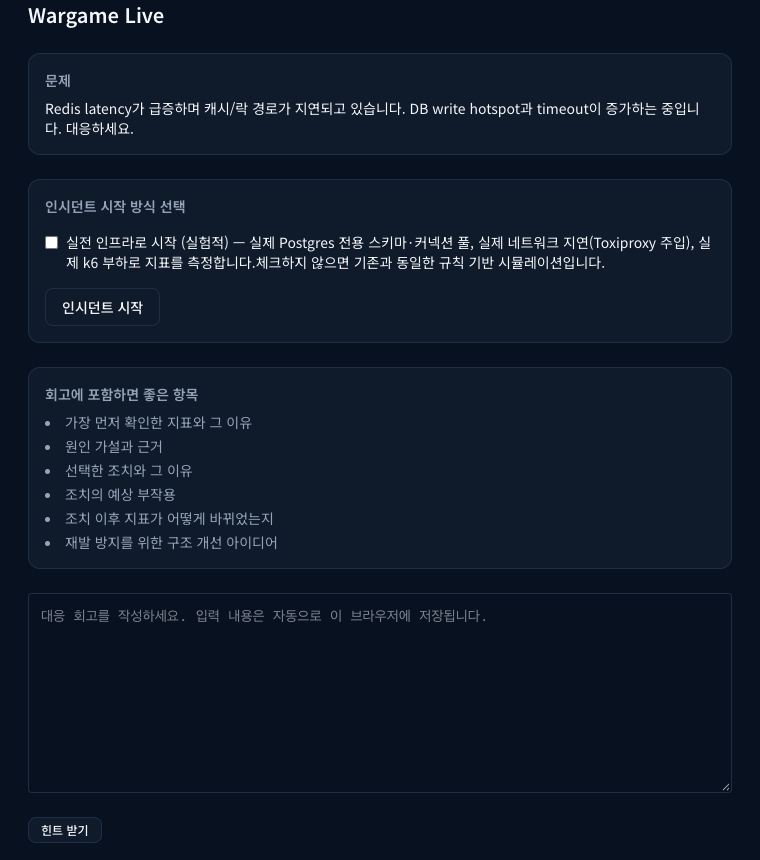
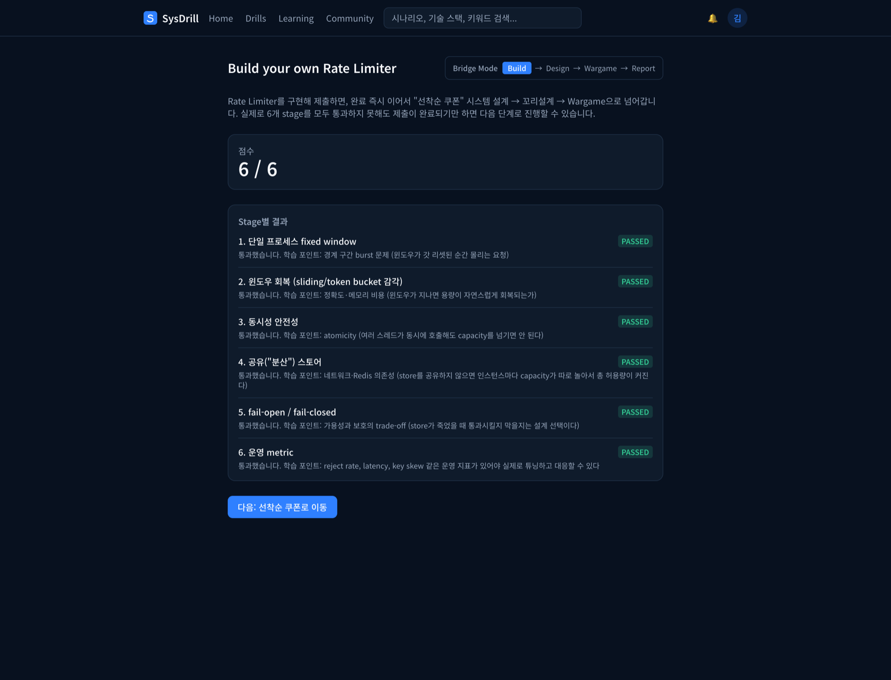
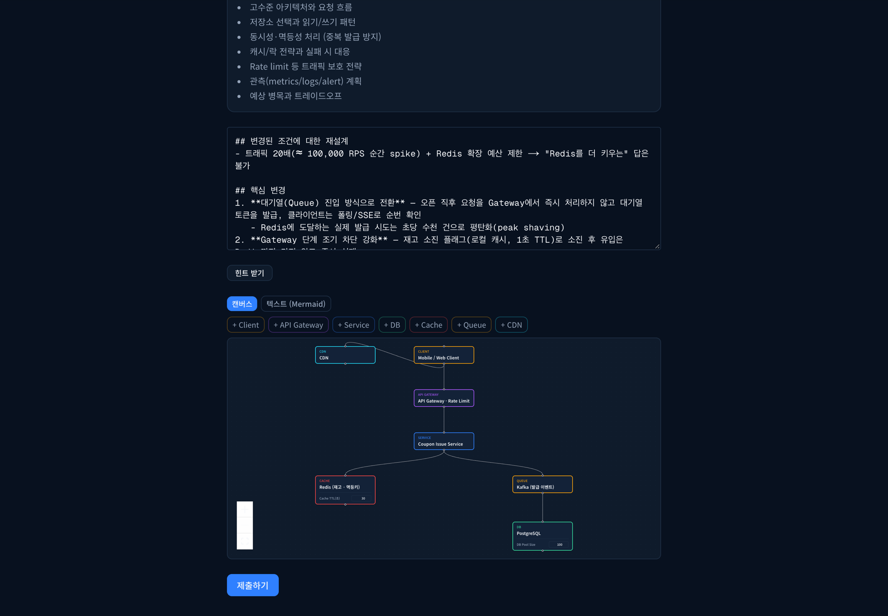
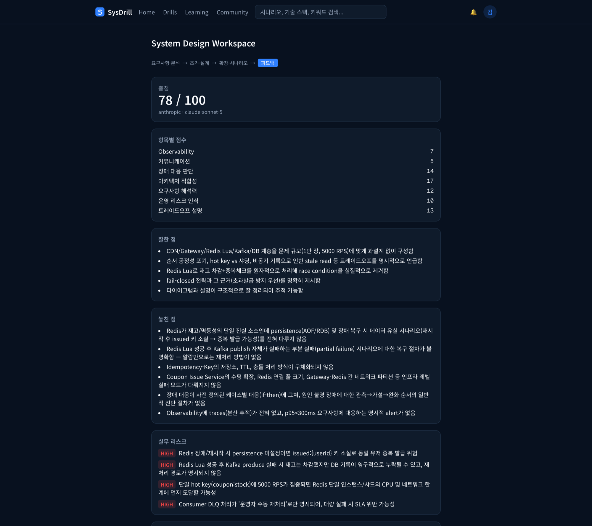
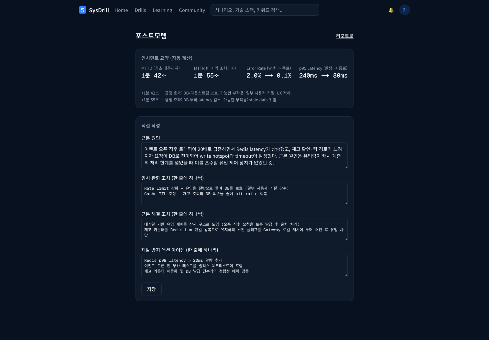
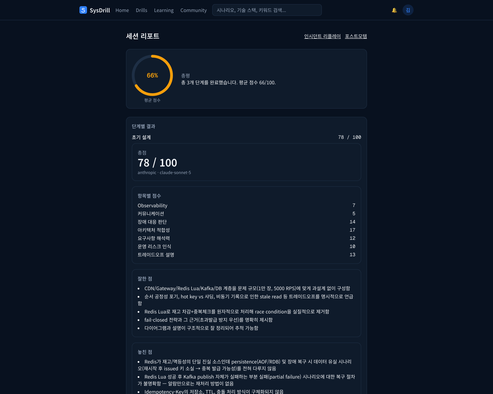
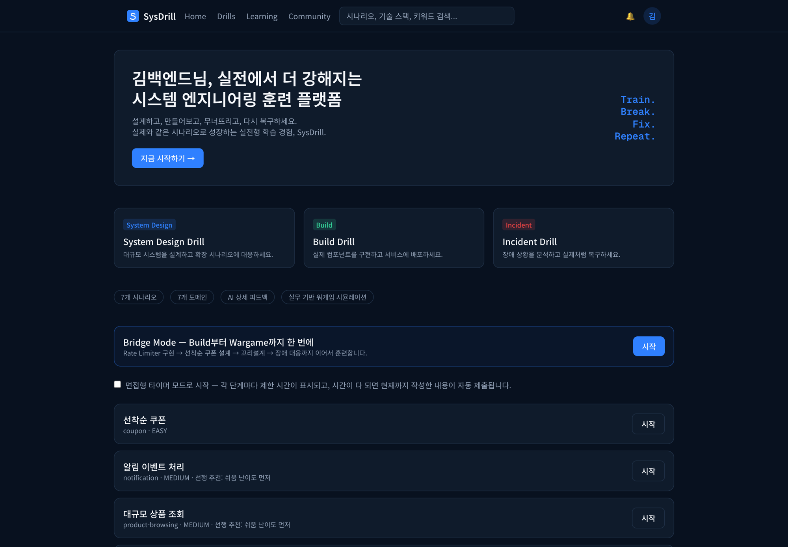
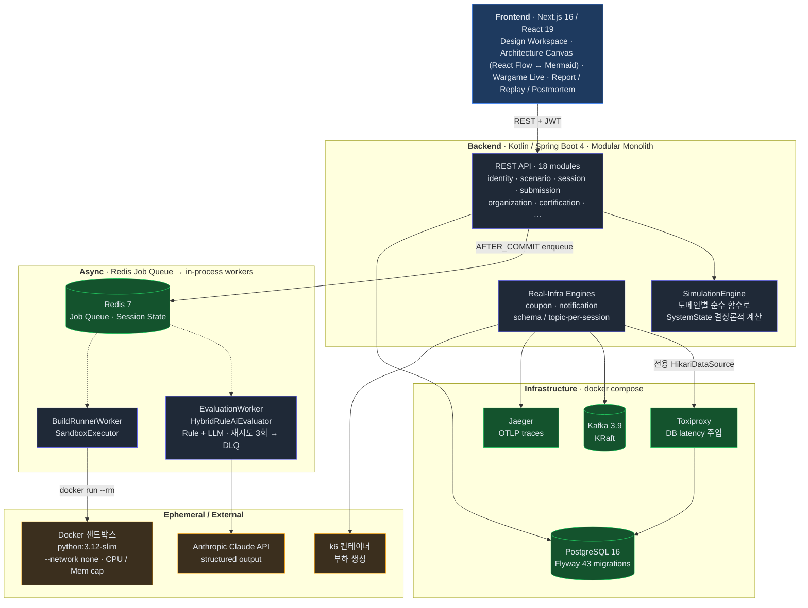
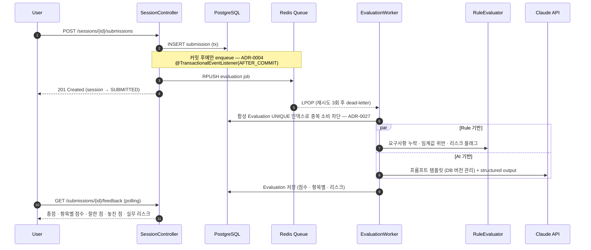

# SysDrill

> **Design. Build. Break. Recover.**
> 백엔드 개발자가 핵심 컴포넌트를 직접 구현하고(Build), 시스템을 설계하고(Design), 트래픽·장애 상황에 워게임처럼 대응하며(Wargame) 반복 훈련하는 플랫폼.

[](https://github.com/polynomeer/sys-drill/actions/workflows/ci.yml)




<sub>Wargame Live — 설계한 시스템에 "Redis latency 급증 → DB write hotspot" 인시던트가 주입되고, Rate Limit 강화 → Cache TTL 조정 액션을 적용하자 RPS 6000→3000, 에러율 2.0%→0.1%로 회복되는 과정. 로그 첫 줄은 AI Director가 생성한 상황 내레이션.</sub>

## 왜 만들었나

CRUD·API·DB 개발 경험은 있지만 **대용량 트래픽, 분산 시스템 운영, 장애 대응 경험**이 부족한 백엔드 개발자가 많습니다. 이 공백은 책이나 강의로 메우기 어렵고, 실제 장애는 회사에서 의도적으로 재현할 수 없습니다.

| 경험 공백 | 알고 있는 수준 | 실무에서 필요한 수준 |
|---|---|---|
| Redis | 캐시로 쓰면 빠르다 | hit ratio, invalidation, hot key, stampede, 장애 시 DB 전이 판단 |
| Kafka/Queue | 비동기 메시징에 쓴다 | lag, retry, DLQ, 중복 처리, ordering, backpressure 판단 |
| 장애 대응 | 로그를 보고 고친다 | MTTD/MTTR, 임시 완화와 근본 해결 구분, postmortem |

SysDrill의 가설은 "수백만 사용자 규모의 경험 자체는 복제할 수 없지만, **부하가 늘 때 어떤 컴포넌트가 먼저 깨지고, 어떤 신호가 나타나고, 어떤 조치가 어떤 부작용을 만드는지**는 통제된 시뮬레이션으로 충분히 반복 훈련할 수 있다"는 것입니다.

## 핵심 학습 루프

```
[Build] 핵심 컴포넌트 구현 (Rate Limiter, Circuit Breaker, ...)
    ↓
[Design] 실제 도메인 시스템 설계 (선착순 쿠폰, 결제, 예약, ...)
    ↓
[Tail Design] 요구사항·제약 변경 — "트래픽이 6배가 되면?" "중복이 절대 불가하다면?"
    ↓
[Wargame] 트래픽/장애 이벤트 발생 — Redis 지연, DB pool 고갈, consumer lag
    ↓
[Response] 관측·완화·복구 — 메트릭/로그를 보고 액션을 선택
    ↓
[Evaluation] Rule + AI 하이브리드 평가 — 점수가 아니라 판단 과정을 본다
    ↓
[Retrospective] 포스트모템·리플레이·다음 훈련 추천
```

| 모드 | 무엇을 하나 | 평가 |
|---|---|---|
| **Build** | 로컬에서 Python으로 컴포넌트를 stage별로 구현하고 CLI로 제출 → Docker 샌드박스에서 자동 채점 | 기능 정확성, 동시성, 실패 모드 |
| **Design** | 도메인 요구사항을 받아 아키텍처를 설계 (텍스트 + Mermaid/캔버스), 조건이 바뀌면 다시 설계 | 요구사항 적합성, trade-off, 리스크 |
| **Wargame** | 설계한 시스템 위에 트래픽·장애가 주입되면 실시간 메트릭을 보고 대응 | MTTD/MTTR, SLO 위반, 잘못된 액션 수 |
| **Bridge** | Build한 컴포넌트를 Design에서 선택하고, Wargame에서 그 선택의 운영 결과를 직접 경험 | 구현·설계·운영 통합 |

**Bridge Mode가 핵심 차별점**입니다. "Rate Limiter를 만들어봤다"와 "선착순 쿠폰 이벤트에서 Rate Limiter가 언제 깨지는지 안다" 사이의 간극을 하나의 흐름으로 연결합니다.

## 화면

| | |
|---|---|
| **Build** — Rate Limiter를 6개 stage로 구현, Docker 샌드박스에서 채점 | **Design (꼬리설계)** — 조건이 바뀌면 캔버스 위 토폴로지를 다시 설계. 노드 config가 시뮬레이션 입력이 됨 |
|  |  |
| **AI 피드백** — Rule + LLM 하이브리드 평가. 루브릭 7항목 점수, 잘한 점·놓친 점, HIGH/MEDIUM 실무 리스크, 꼬리질문 | **Postmortem** — MTTD/MTTR·지표 변화를 자동 계산, 근본 원인과 재발 방지를 직접 작성 |
|  |  |
| **Report** — 초기 설계 → 꼬리설계 → 장애 대응 3단계 결과와 다음 추천 Drill | **Dashboard** — 도메인별 시나리오, Bridge Mode, 난이도 기반 선행 추천 |
|  |  |

## 아키텍처



**시뮬레이션은 두 층으로 동작합니다.**

- **Rule-based 엔진** — 도메인별 순수 함수. 사용자 액션과 시나리오 이벤트로부터 다음 `SystemState`(p95, error rate, pool 사용률, consumer lag …)를 결정론적으로 계산합니다. 같은 seed면 같은 결과가 나오므로 리플레이는 재계산으로 복원합니다.
- **Real-infra 파일럿** — 쿠폰(Postgres + Toxiproxy + k6), 알림(Kafka) 도메인은 실제 인프라를 세션마다 격리해서 띄우고, 실제 지연/부하를 주입한 뒤 Jaeger 트레이스로 관측합니다. "100% digital twin"을 약속하지 않고, 교육 효과가 큰 도메인에만 선택적으로 적용합니다.

자세한 설계는 [docs/ARCHITECTURE.md](docs/ARCHITECTURE.md), 결정 배경은 [docs/adr/](docs/adr/README.md)를 참고하세요.

**제출 → 평가 파이프라인** — 사용자 요청 스레드와 LLM 호출을 분리하고, 커밋 전 큐잉·중복 소비를 구조적으로 막습니다.




## 기술 스택

| 영역 | 선택 |
|---|---|
| Backend | Kotlin 2.3, Spring Boot 4.1, Spring Data JPA, Flyway, Java 21 |
| Frontend | Next.js 16 (App Router), React 19, TypeScript, Tailwind CSS 4, React Flow, Mermaid, CodeMirror, Recharts |
| Data | PostgreSQL 16, Redis 7 |
| Real-infra 시뮬레이션 | Apache Kafka 3.9 (KRaft), Toxiproxy, k6, Jaeger + OpenTelemetry |
| AI | Anthropic Claude API — structured output, 프롬프트 템플릿 DB 버전 관리 |
| 실행 격리 | Docker (Build 과제 채점 샌드박스) |
| 인증 | JWT, Google OAuth, 조직 초대/RBAC, 감사 로그 |
| 관측/품질 | Actuator, Sentry, JaCoCo, GitHub Actions CI, Dependabot |

## 엔지니어링 하이라이트

의사결정 38건을 [ADR](docs/adr/README.md)로 기록했습니다. 아래 항목을 문제 → 선택 → 근거 → 코드 위치 순으로 풀어 쓴 문서가 [docs/TECHNICAL_HIGHLIGHTS.md](docs/TECHNICAL_HIGHLIGHTS.md)입니다.

- **Docker 네트워크 격리 샌드박스 채점** ([ADR-0007](docs/adr/0007-docker-sandboxed-build-execution.md)) — 사용자 코드를 `--network none`, CPU/메모리 제한, 타임아웃 하에서 실행. 채점 스크립트 자체는 파일시스템이 아니라 DB에 버전 관리 ([ADR-0006](docs/adr/0006-config-as-data.md)).
- **트랜잭션 커밋 후에만 큐에 push** ([ADR-0004](docs/adr/0004-async-jobs-enqueued-only-after-commit.md)) — 워커가 아직 커밋되지 않은 Submission을 읽고 조용히 job을 버리던 경쟁 조건을 `@TransactionalEventListener(AFTER_COMMIT)`로 차단. 두 파이프라인에서 같은 버그가 독립적으로 재발한 뒤 규칙이 됨.
- **평가 멱등성을 DB 제약으로 보장** ([ADR-0027](docs/adr/0027-evaluation-idempotency-guarded-by-db-constraint-not-just-in-app-dedup-check.md)) — 앱 레벨 dedup 체크만으로는 at-least-once 큐의 중복 소비를 못 막는다는 판단.
- **Schema-per-session 실제 인프라 시뮬레이션** ([ADR-0013](docs/adr/0013-coupon-real-infra-pilot-schema-per-session.md)) — 컨테이너-per-session 대신 Postgres 스키마 + 전용 HikariDataSource + Toxiproxy 프록시를 세션마다 할당. 유휴 세션은 백그라운드 sweep으로 회수.
- **아키텍처 캔버스가 시뮬레이션 토폴로지의 source of truth** ([ADR-0037](docs/adr/0037-architecture-canvas-becomes-the-simulation-topology-source-of-truth.md)) — 그림이 아니라 실행 가능한 모델. 노드 config(인스턴스 수, pool, TTL)를 바꾸면 워게임 결과가 달라집니다.
- **파생값은 절대 저장하지 않는다** ([ADR-0011](docs/adr/0011-derived-values-are-never-persisted.md)) — 인증(certification), 스킬 프로필 등은 항상 읽기 시점에 계산. 기준이 바뀌어도 마이그레이션이 필요 없습니다.

## 프로젝트 규모

| 항목 | 수치 |
|---|---|
| 개발 기간 | 2026-08-24 ~ (진행 중), 커밋 230+ |
| 백엔드 | Kotlin 179 파일 · 도메인 모듈 18개 · Flyway 마이그레이션 43개 |
| 테스트 | 테스트 클래스 63개 · `@Test` 295개 (단위 + 실제 compose 스택 대상 통합 + real-infra 파일럿 범위 단언) |
| 프론트엔드 | 페이지 30개 · TypeScript/TSX 54 파일 |
| 콘텐츠 | 시나리오 도메인 7개 (쿠폰·알림·상품조회·결제·예약·배치정산·오토스케일링) · Build 과제 6개 (Rate Limiter·Queue·Circuit Breaker·Distributed Lock·Retry/Backoff·Event Bus) |
| 문서 | PRD · 아키텍처 · 로드맵 · ADR 38건 · UX 전략 · 상용화 계획 |

## Quick Start

### 요구 사항

- Docker Desktop (Postgres/Redis/Kafka/Toxiproxy/Jaeger 컨테이너 + Build 채점 샌드박스)
- JDK 21, Node.js 22, Python 3

### 실행

```bash
git clone https://github.com/polynomeer/sys-drill.git
cd sys-drill
cp .env.example backend/.env.local   # 선택 — LLM API 키 등. 없어도 스텁 평가로 전체 흐름이 동작합니다
./scripts/run.sh
```

스크립트가 Docker 스택 → 백엔드(8081) → 프론트엔드(3000) 순으로 띄우고, 포트가 이미 사용 중이면 자동으로 다음 포트로 우회합니다.

- 프론트엔드 → http://localhost:3000
- 백엔드 → http://localhost:8081 (`/actuator/health`)
- Jaeger UI → http://localhost:16686

`backend/.env.local`은 `bootRun`이 시작할 때 환경변수로 읽어들입니다 (테스트에는 적용되지 않음). 변수 목록과 설명은 [.env.example](.env.example)에 있습니다.

### Build 과제 풀어보기

```bash
cd challenges/rate-limiter
# rate_limiter.py 의 TODO 를 채운 뒤
python3 -c "import sys; sys.path.insert(0, '.'); exec(open('stages/stage1_test.py').read())"   # 로컬 검증
SYSDRILL_USER_ID=<온보딩에서 발급된 ID> ./submit.sh                                         # 서버 채점
```

### 테스트

```bash
cd backend && ./gradlew test        # compose 스택이 떠 있어야 합니다
```

로컬 개발 스택과 격리된 별도 컨테이너로 돌리려면 `./scripts/run-tests-isolated.sh`를 사용합니다. CI는 [.github/workflows/ci.yml](.github/workflows/ci.yml)에서 동일한 compose 스택 위에서 백엔드/프론트엔드를 검증합니다. 테스트 구조와 전략은 [docs/TESTING.md](docs/TESTING.md).

## 문서

| 문서 | 내용 |
|---|---|
| [docs/PRD.md](docs/PRD.md) | 제품 정의, 타깃, 4개 모드, 평가 루브릭, MVP 범위, 비즈니스 모델 |
| [docs/ARCHITECTURE.md](docs/ARCHITECTURE.md) | 설계 원칙, 도메인 모델, 세션 상태 머신, 시뮬레이션/평가 파이프라인 |
| [docs/TECHNICAL_HIGHLIGHTS.md](docs/TECHNICAL_HIGHLIGHTS.md) | 어려웠던 문제 7가지와 삽질 기록 — 문제 → 선택 → 근거 → 코드 위치 |
| [docs/adr/](docs/adr/README.md) | 아키텍처 결정 기록 38건 — "왜 이렇게 했는가" |
| [docs/DEVELOPMENT.md](docs/DEVELOPMENT.md) · [docs/TESTING.md](docs/TESTING.md) | 로컬 실행, 저장소 규칙, Build 과제 추가 방법 · 세 층 테스트 전략과 플레이키니스 대응 |
| [frontend/README.md](frontend/README.md) | 프론트엔드 구조, api.ts 단일 진입점, 캔버스 ↔ Mermaid ↔ 토폴로지 관계 |
| [docs/ROADMAP.md](docs/ROADMAP.md) | Phase 1 (MVP) ~ Phase 6 (Architecture Linter) |
| [docs/DRILLS_SIMULATION_VISION.md](docs/DRILLS_SIMULATION_VISION.md) | Architecture Canvas ↔ Simulation 연동 비전과 현재 구현 격차 분석 |
| [docs/UX_STRATEGY.md](docs/UX_STRATEGY.md) · [docs/COMMERCIALIZATION.md](docs/COMMERCIALIZATION.md) | UX 전략, 상용화 준비 (인증/결제/운영) |
| [PLAN.md](PLAN.md) | 단계별 작업 기록 — 각 단계에서 무엇을 했고 무엇에 걸렸는지 (개발 일지) |

## 라이선스

[MIT](LICENSE)
