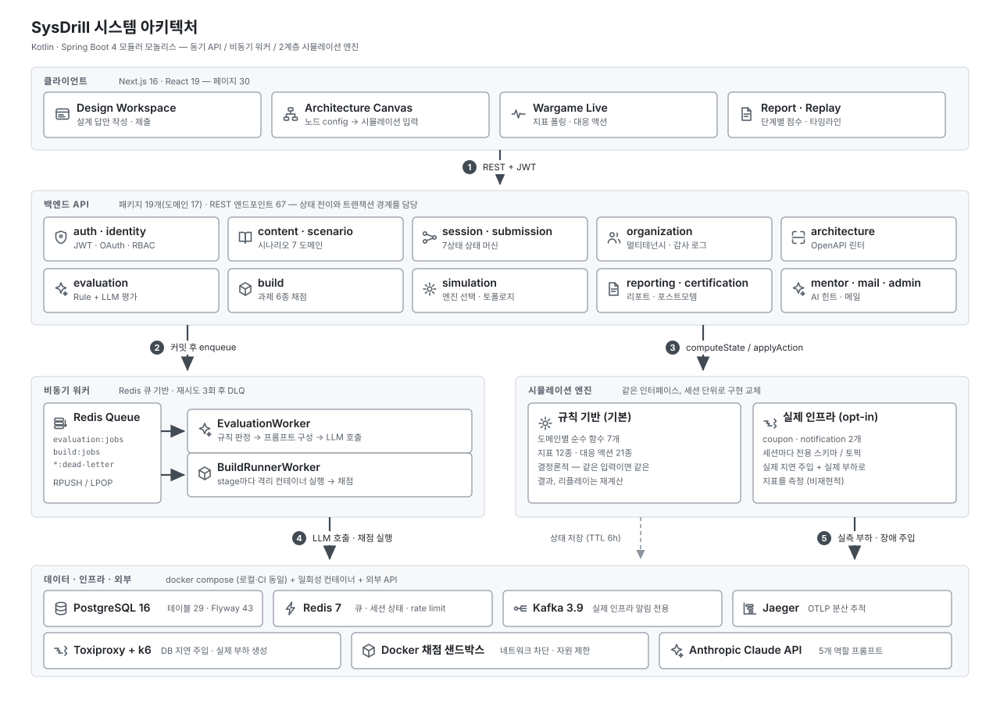
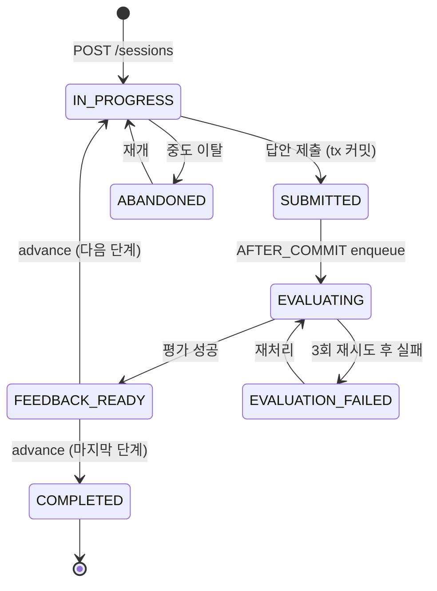

# SysDrill 시스템 아키텍처 설계서

> 제품 요구사항은 [PRD.md](PRD.md), 결정의 근거는 [ADR 42건](adr/README.md), 단계별 구현 기록은 [PLAN.md](../PLAN.md)을 참고하세요.
>
> **이 문서는 2026-09-29 기준 실제 구현 상태를 기술합니다.** 초기 기획 시점의 설계안 중 실제로 다르게 구현된 것은 현재 구현을 기준으로 서술하고 차이를 명시했으며, 아직 만들지 않은 것은 **(미구현)** 으로 표시했습니다.

---

## 1. 설계 원칙

1. **모듈러 모놀리스로 시작한다.** 제품 도메인과 학습 UX가 빠르게 바뀌므로 서비스 경계보다 실험 속도를 우선한다. 배포 단위는 하나로 두되 패키지 경계는 엄격히 유지한다.
2. **평가는 Rule + AI 하이브리드다.** 결정 가능한 사실(요구사항 누락, 임계값 위반)은 규칙 엔진이 판정하고, AI는 트레이드오프 타당성·설명 품질·꼬리질문 생성을 담당한다. 규칙 판정 결과는 LLM 프롬프트의 입력으로도 들어간다(§8).
3. **시뮬레이션은 상태 머신이다.** 사용자 액션과 시나리오 이벤트가 다음 `SystemState`를 결정하며, 문제 중심이 아니라 `Scenario → Session → SimulationState` 중심으로 모델링한다.
4. **모든 의사결정을 기록한다.** `submissions`와 `applied_actions`가 점수·리플레이·포스트모템·장기 약점 프로필의 원천이 된다.
5. **장시간 작업은 비동기로 처리한다.** 제출(Submission)과 평가(Evaluation)를 분리해 API 응답 지연과 LLM 실패가 사용자 요청 스레드에 결합되지 않게 한다.
6. **버전 메타데이터를 강제 저장한다.** ScenarioVersion, PromptTemplate, Rubric은 모두 버전을 가지며 평가 결과는 재현 가능해야 한다.
7. **100% digital twin을 약속하지 않는다.** 기본은 교육 목적의 인과관계를 명확히 보여주는 규칙 기반 추상 시뮬레이션이다. 단, 이 원칙은 Phase 3에서 **의도적으로 부분 완화**됐다 — 교육 효과가 큰 두 도메인에 한해 실제 인프라를 세션 단위로 띄우는 opt-in 경로를 추가했다([ADR-0013](adr/0013-coupon-real-infra-pilot-schema-per-session.md), §7).
8. **파생값은 저장하지 않는다.** `SystemState`, 스킬 추세, 인증 통과 여부는 전부 읽기 시점에 계산한다([ADR-0011](adr/0011-derived-values-are-never-persisted.md)). 유일한 예외는 측정이 근본적으로 재현 불가능한 실제 인프라 스냅샷이다([ADR-0016](adr/0016-incident-replay-snapshots-only-for-real-infra.md)).

---

## 2. 논리 아키텍처



### 2.1 계층별 책임

| 계층 | 구성 | 책임 | 하지 않는 것 |
|---|---|---|---|
| **Frontend** | Next.js 16 App Router, 페이지 30개(26개 client) | 설계 입력, 캔버스 편집, 실시간 지표 폴링·렌더링, 리포트 표시 | 서버 컴포넌트에서 DB 직접 접근 없음. 점수 계산·상태 전이 판정 없음 |
| **REST API** | 패키지 19개(도메인 17 + 공통·도구 2), 엔드포인트 67개 | 인증·권한 검사, 상태 전이, 트랜잭션 경계, 이벤트 발행 | LLM 호출·코드 실행·부하 생성을 요청 스레드에서 하지 않음 |
| **비동기 워커** | `EvaluationWorker`, `BuildRunnerWorker`, `RealInfraSessionSweepWorker` (모두 인프로세스 단일 스레드) | LLM 평가, 샌드박스 채점, 유휴 자원 회수 | 사용자 요청을 직접 받지 않음 |
| **Simulation Engine** | `RuleBasedSimulationEngine` + `RealInfra*Engine` 2종 | `SystemState` 계산, 액션 적용 | 영속화 없음(순수 함수). 상태 보관은 `SimulationStateStore`(Redis)가 담당 |
| **Infrastructure** | Postgres · Redis · Kafka · Toxiproxy · Jaeger (docker compose) | 영속·큐·실제 인프라 시뮬레이션 대상 | — |

### 2.2 세 가지 주요 요청 흐름

**(a) 설계 제출 → 평가** (비동기, 수 초~수십 초)

```
POST /sessions/{id}/submissions
  → Submission INSERT (tx)
  → 커밋 후 Redis RPUSH                     [ADR-0004]
  → 201 Created (세션 SUBMITTED → EVALUATING)
  ⋯ EvaluationWorker LPOP
  → RuleEvaluator 판정 → 그 결과를 프롬프트에 포함 → Claude 호출
  → Evaluation INSERT (활성 1건 UNIQUE)      [ADR-0027]
  → 세션 FEEDBACK_READY
GET /submissions/{id}/feedback  (프론트 폴링)
```

**(b) 워게임 인시던트** (동기, 규칙 기반이면 ms 단위)

```
POST /sessions/{id}/simulation/incident
  → SystemTopology에서 DesignTraits 파생      [ADR-0037]
  → 엔진 선택 (도메인 → 규칙 기반 | 실제 인프라)  [ADR-0018]
  → SimulationSessionState를 Redis에 저장 (TTL 6h)
  → SystemState 계산 후 반환
POST /sessions/{id}/simulation/actions   (액션 적용, 3초 폴링과 병행)
GET  /sessions/{id}/simulation/state     (WargameLive 3초 폴링)
GET  /sessions/{id}/simulation/timeline  (AppliedAction 재생 → 리플레이)
```

**(c) Build 과제 채점** (비동기, 컨테이너 기동 포함)

```
POST /build-challenges/{slug}/submissions
  → BuildSubmission INSERT → 커밋 후 enqueue
  ⋯ BuildRunnerWorker LPOP
  → stage마다 docker run (네트워크 차단·자원 제한)
  → BuildStageResult 저장 → 종합 점수
GET /build-submissions/{id}  (프론트 폴링)
```

---

## 3. 기술 스택

| 영역 | 선택 | 비고 |
|---|---|---|
| Backend | Kotlin 2.3, Spring Boot 4.1, Java 21 | 모듈러 모놀리스(패키지 19개 · 179 파일). Spring Data JPA + Flyway |
| Frontend | Next.js 16 (App Router), React 19, TypeScript, Tailwind 4 | 아키텍처 입력은 React Flow 캔버스 → Mermaid 직렬화([ADR-0035](adr/0035-diagrams-are-mermaid-text-embedded-in-the-existing-answer-not-a-new-field-or-editor.md)/[0036](adr/0036-diagram-canvas-is-an-input-method-that-still-serializes-to-mermaid-text.md)/[0037](adr/0037-architecture-canvas-becomes-the-simulation-topology-source-of-truth.md)). 코드 입력은 CodeMirror |
| Primary DB | PostgreSQL 16 | 테이블 29개. JSONB를 가변 스키마 영역에 사용. QueryDSL/jOOQ는 도입하지 않음 — JPA + 파생 쿼리로 충분 |
| Cache/Queue | Redis 7 | Job Queue, 세션 시뮬레이션 상태(TTL 6h), auth rate limit |
| AI | Anthropic Claude API | 5개 역할 프롬프트를 DB에서 버전 관리. 키 미설정 시 오프라인 스텁으로 폴백 |
| Build Runner | Docker (`python:3.12-slim`, `node:22-slim`, `eclipse-temurin:25-jdk`, 자체 빌드 Kotlin·Go 이미지) | `docker run` CLI 직접 호출 — Testcontainers 미사용([ADR-0007](adr/0007-docker-sandboxed-build-execution.md)/[0008](adr/0008-python-for-build-challenges.md)/[0051](adr/0051-compiled-language-sandboxes-get-own-images-and-limits.md)) |
| 실제 인프라 시뮬레이션 | Kafka 3.9(KRaft), Toxiproxy 2.9, k6 | **시뮬레이션 대상**으로서의 인프라(§7) |
| Observability | OpenTelemetry → Jaeger(OTLP), Spring Actuator, Sentry | 실제 인프라 구간 추적용. Prometheus/Grafana는 **(미구현)** |
| 인증 | 자체 JWT(java-jwt HMAC), Google OAuth, 조직 RBAC | SSO/SAML은 **(미구현)** |
| Object Storage | — | **(미구현)** S3 호환 스토리지는 도입하지 않았다. 다이어그램은 Mermaid 텍스트, 코드는 DB 컬럼으로 저장해 현재까지 불필요 |
| Vector Store | — | **(미구현)** pgvector 기반 RAG는 검토만 |

**애플리케이션 자체의 큐는 여전히 Redis다.** Kafka는 이 백엔드의 비동기 처리에 쓰이지 않는다 — Kafka가 스택에 있는 이유는 오직 "알림 도메인 워게임에서 사용자가 진짜 consumer lag을 관측하게 하기 위한 **시뮬레이션 대상**"이기 때문이다(§7.2). 초기 기획의 "MVP에서는 Kafka를 도입하지 않는다"는 원칙은 애플리케이션 인프라 관점에서 그대로 유효하다.

---

## 4. 핵심 도메인 모델

세 핵심 Aggregate는 **Scenario, Session, SimulationState**다.

- **Scenario** — 무슨 사건이 어떤 조건에서 발생할 수 있는가 (버전 고정된 정의)
- **Session** — 사용자가 무엇을 선택했는가 (기록)
- **SimulationState** — 그 선택의 결과 지금 시스템이 어떤 상태인가 (Redis, 파생)

```
ContentItem ─1:N─ Scenario ─1:N─ ScenarioVersion ─1:N─ ScenarioStep
                     │                  │
                     │ (organization_id: nullable → 커스텀 시나리오)
                     │                  │
User ─1:N─ Session ──┴──────────────────┘
             ├─1:N─ SessionPhase            단계 히스토리
             ├─1:N─ Submission ─1:N─ Evaluation ─1:N─ EvaluationRiskFlag
             ├─1:N─ AppliedAction           액션 이력(+ real-infra 스냅샷)
             ├─0:1─ SystemTopology          캔버스 그래프 (시뮬레이션 입력)
             ├─0:1─ Postmortem
             ├─1:N─ SessionChatMessage      Game Day 관전 채팅
             ├─0:N─ Report                  버전 관리
             └─0:1─ BuildSubmission         Bridge Mode 연결 (FK 1개, ADR-0009)

User ─1:1─ SkillProfile
User ─1:N─ BuildSubmission ─N:1─ BuildChallenge ─1:N─ BuildStage
BuildSubmission ─1:N─ BuildStageResult

Organization ─1:N─ OrganizationMembership ─N:1─ User
             ├─1:N─ OrganizationInvitation        이메일 바인딩 초대(ADR-0023)
             ├─1:N─ OrganizationAssessment        외부 평가 링크(ADR-0033)
             ├─1:N─ OrganizationCurriculumStep    advisory 커리큘럼(ADR-0030)
             └─1:N─ OrganizationAuditLogEntry     동기 기록(ADR-0029)
```

**애그리거트 경계를 넘는 참조는 JPA 관계가 아니라 UUID 스칼라 필드다**([ADR-0001](adr/0001-plain-uuid-scalar-references-across-aggregates.md)). 위 그림의 선은 논리적 관계이지 `@ManyToOne` 매핑이 아니다.

### 4.1 테이블 (29개)

| 그룹 | 테이블 | 핵심 컬럼 / 역할 |
|---|---|---|
| 사용자·인증 | `users` | email, password_hash, nickname, experience_years, primary_stack, platform_role |
| | `password_reset_tokens`, `email_verification_tokens` | 만료 있는 일회성 토큰 |
| 콘텐츠 | `content_items` | type, title, difficulty, version — 시나리오/Build 과제 공통 카탈로그 |
| | `scenarios` | content_id, domain, base_requirements, **scoring_profile**(커스텀 루브릭), organization_id, visibility, creator_id |
| | `scenario_versions` | version_no, followup_rules, incident_rules — 재현 가능한 버전 고정 |
| | `scenario_steps` | step_order, step_type(INITIAL/FOLLOWUP/INCIDENT), trigger_condition, content |
| 세션 | `sessions` | user_id, scenario_version_id, status, current_phase, seed, interview_mode, build_submission_id |
| | `session_phases` | phase_type, order, status — 단계 히스토리 |
| | `session_chat_messages` | Game Day 관전자 채팅([ADR-0026](adr/0026-game-day-spectating-is-scoped-by-shared-org-membership-and-still-defers-websocket.md)) |
| 제출·평가 | `submissions` | session_id, phase, raw_text, structured_json, client_request_id, on_time |
| | `evaluations` | submission_id, rubric_version, score_dimensions, strengths, weaknesses, **is_active** — 활성 1건 부분 UNIQUE 인덱스 |
| | `evaluation_risk_flags` | risk_key, severity(MEDIUM=규칙 / HIGH=LLM), description |
| | `prompt_templates` | purpose, version, template_body, active — AI 프롬프트 버전 관리 |
| 시뮬레이션 | `applied_actions` | action_type, parameters(JSONB: engine_mode + real-infra 스냅샷) |
| | `system_topologies` | session_id, graph(JSONB) — 캔버스 노드/엣지 + 노드별 config |
| | `postmortems` | root_cause, mitigations, root_fixes, action_items |
| 리포트 | `reports` | session_id, version, summary, timeline_feedback, improvement_guide, build_summary |
| | `skill_profiles` | user_id, weaknesses, trend — 장기 개인화 |
| Build | `build_challenges` / `build_stages` | slug, stage_order, **test_script**(DB에 저장, ADR-0006) |
| | `build_submissions` / `build_stage_results` | source_code, status, score / stage별 통과 여부·출력 |
| 조직 | `organizations`, `organization_memberships` | 멀티테넌시 루트, role(ADMIN/MEMBER) |
| | `organization_invitations` | email 바인딩 + 불투명 UUID 토큰([ADR-0022](adr/0022-organization-invitation-token-is-an-opaque-db-code-not-a-jwt.md)) |
| | `organization_assessments` | 외부 후보자용 평가 링크 |
| | `organization_curriculum_steps` | advisory 학습 순서 |
| | `organization_audit_log_entries` | 조직 단위 행위 기록(동기 저장) |

**저장되지 않는 것**: 인증(certification) 결과, `SystemState`, 스킬 추세 방향, 리포트 평균 점수 — 전부 읽기 시점 계산이다(§1 원칙 8).

**정규 컬럼 vs JSONB 기준**: 조회·필터·정렬에 쓰이는 값(상태, 점수, 시각, FK)은 정규 컬럼. 스키마가 도메인마다 다르거나 자주 바뀌는 값(시나리오 rule, 캔버스 그래프, AI 구조화 결과, 액션 파라미터)은 JSONB.

---

## 5. 세션 상태 머신



| 상태 | 의미 |
|---|---|
| `IN_PROGRESS` | 현재 단계를 푸는 중 |
| `SUBMITTED` | 답안 저장 완료, 큐잉 직전 |
| `EVALUATING` | 워커가 평가 중 |
| `FEEDBACK_READY` | 피드백 확인 가능, 다음 단계 진행 가능 |
| `EVALUATION_FAILED` | 재시도 한도 초과 |
| `COMPLETED` | 세션 종료 + 리포트 생성됨 (종결 상태 — 재제출 불가) |
| `ABANDONED` | 중도 이탈 |

**동시성 제어**: 전이는 상태 조건부 UPDATE(`compareAndSetStatus`)로 수행한다. `UPDATE sessions SET status=? WHERE id=? AND status=?`가 0행을 반환하면 다른 요청이 이미 전이시킨 것으로 보고 중복 Submit/Advance를 무시한다. 제출 자체의 중복은 `client_request_id`로 한 번 더 막는다.

**단계 구성**: 기본 3단계(INITIAL → FOLLOWUP → INCIDENT). `interview_mode` 세션은 단계별 제한 시간(기본 600/600/480초)이 붙고 시간 초과 시 자동 제출되며, `submissions.on_time`에 기록돼 평가 프롬프트에 전달된다.

---

## 6. Simulation Engine

### 6.1 인터페이스와 2계층 구조

```kotlin
interface SimulationEngine {
    fun computeState(session: SimulationSessionState): SystemState
    fun applyAction(current: SimulationSessionState, action: SimulationActionType): SimulationSessionState
}
```

구현은 두 가지이고 **세션 단위로 교체**된다([ADR-0018](adr/0018-real-infra-engine-selection-by-domain-map.md)).

| | `RuleBasedSimulationEngine` (기본) | `RealInfraCouponEngine` / `RealInfraNotificationEngine` (opt-in) |
|---|---|---|
| 계산 방식 | 도메인별 순수 함수 | 실제 부하 측정값 |
| 적용 도메인 | 7개 전부 | coupon, notification |
| 결정론 | 있음 (같은 입력 → 같은 출력) | 없음 |
| 리플레이 | 액션 이력으로 **재계산** | 스냅샷 **저장** ([ADR-0016](adr/0016-incident-replay-snapshots-only-for-real-infra.md)) |
| 테스트 단언 | 손계산 값과 정확히 일치 | 범위·상대 비교 ([ADR-0014](adr/0014-real-infra-tests-use-range-assertions.md)) |
| 지연 | 마이크로초 | 수 초 (k6/Kafka 프로브) |

**도메인마다 범용 엔진이 아니라 별도 함수를 둔 이유**([ADR-0010](adr/0010-simulation-engine-per-domain-functions.md)): 7개 인시던트는 병목 자원이 서로 다르다(DB 쓰기 용량, consumer 처리량, 캐시 hit ratio, 재처리 레코드 수, pod 수). 이를 데이터 주도 엔진으로 표현하려면 작은 공식 언어가 필요하고, 그러면 모든 수치를 손계산과 대조하는 기존 테스트 관행이 무너진다. 새 도메인은 기존 것의 복사본이 아니라 진짜 다른 메커니즘이어야 한다([ADR-0012](adr/0012-new-incident-domains-get-distinct-mechanisms.md)).

### 6.2 상태와 입력

```kotlin
data class SystemState(
    val trafficRps: Double, val p95LatencyMs: Double, val errorRate: Double, val availability: Double,
    val dbReadLoad: Double, val dbWriteLoad: Double, val connectionPoolUsage: Double,
    val cacheHitRatio: Double, val cacheLatencyMs: Double,
    val queueLag: Long, val consumerThroughput: Double, val externalDependencyLatencyMs: Double,
) {
    val cpuUtilization: Double get() = /* 위 지표 중 가장 나쁜 것에서 파생 — 저장하지 않음 */
}

// NextState = f(CurrentState, Incident, DesignTraits, AppliedAction)
```

`DesignTraits`는 기획 초안의 추상 정책 객체(`RateLimitPolicy?`, `CacheStrategy?` …)가 아니라, **도메인별 평면 원시값 21개**로 구현됐다. 각 필드가 정확히 하나의 `SimulationActionType`과 1:1로 대응하기 때문이다.

| 도메인 | DesignTraits 필드 | 대응 액션 |
|---|---|---|
| coupon | `rateLimitEnabled`, `cacheTtlSeconds`(10), `dbPoolSize`(50) | STRENGTHEN_RATE_LIMIT, INCREASE_CACHE_TTL, INCREASE_DB_POOL |
| notification | `consumerCount`(4), `circuitBreakerEnabled`, `retryBackoffMultiplier`(1) | ADD_CONSUMERS, ENABLE_CIRCUIT_BREAKER, ADJUST_RETRY_BACKOFF |
| product-browsing | `cachePolicySplit`, `singleFlightEnabled`, `readReplicaCount`(0) | SPLIT_CACHE_POLICY, ENABLE_SINGLE_FLIGHT, ADD_READ_REPLICA |
| payment | `dispatcherWorkers`(4), `idempotentPgRetryEnabled`, `paymentPoolIsolated` | ADD_DISPATCHER_WORKERS, ENABLE_IDEMPOTENT_PG_RETRY, ISOLATE_PAYMENT_POOL |
| reservation | `fineGrainedLockingEnabled`, `holdTimeoutSeconds`(300), `atomicInventoryCheckEnabled` | ENABLE_FINE_GRAINED_LOCKING, SHORTEN_HOLD_TIMEOUT, ENABLE_ATOMIC_INVENTORY_CHECK |
| batch-settlement | `checkpointingEnabled`, `chunkSize`(10000), `idempotentReconciliationEnabled` | ENABLE_CHECKPOINT_RESTART, REDUCE_CHUNK_SIZE, ENABLE_IDEMPOTENT_RECONCILIATION |
| autoscaling | `podReplicas`(4), `resourceLimitsTuned`, `rolloutSafeguardEnabled` | SCALE_OUT_REPLICAS, TUNE_RESOURCE_LIMITS, ENABLE_ROLLOUT_SAFEGUARD |

### 6.3 병목 계산의 단순화 기준

```
utilization = incoming_load / max_capacity

0~60%    안정
60~80%   latency 증가
80~95%   p95/p99 급등
95%+     error 증가
100%+    timeout/drop
```

실제 인프라를 완벽히 재현하지 않는다. 목적은 "부하가 늘 때 **어떤 컴포넌트가 먼저 깨지고 어떤 신호가 나타나는지**"를 반복 경험하게 하는 것이다.

### 6.4 액션의 인과와 부작용

모든 액션은 긍정 효과와 부작용을 함께 모델링한다. 무조건적인 scale-out이나 무분별한 retry 증가는 감점 요인이 될 수 있다.

| 액션 | 긍정 효과 | 부작용 |
|---|---|---|
| Rate Limit 강화 | DB/다운스트림 보호 | 일부 사용자 거절, UX 저하 |
| Cache TTL 증가 | DB 부하·latency 감소 | stale data 위험 |
| Consumer scale-out | queue lag 감소 | 외부 API/DB로 병목 전이 |
| Retry 백오프 조정 | 일시 장애 복구율 증가 | retry storm, 중복 처리 |
| DB pool 증가 | 대기 요청 일부 감소 | DB 자체 한계 초과 가능 |
| Read replica 추가 | 읽기 부하 분산 | 복제 지연에 따른 stale read |

### 6.5 아키텍처 캔버스 ↔ 시뮬레이션 연동

[ADR-0037](adr/0037-architecture-canvas-becomes-the-simulation-topology-source-of-truth.md)에서 캔버스는 "그림"에서 **시뮬레이션 입력**으로 승격됐다.

```
사용자가 캔버스에서 DB 노드의 pool size를 100으로 설정
  → PUT /sessions/{id}/topology  (즉시 저장, 제출과 무관)
  → 인시던트 시작 시 SystemTopologyService.deriveDesignTraits()
  → DesignTraits(dbPoolSize = 100) 으로 엔진 호출
  → 같은 인시던트라도 결과 수치가 달라짐
```

- 백엔드 `TOPOLOGY_FIELDS`와 프론트 `NODE_TRAIT_CONFIG`는 7개 도메인 전부에서 **필드 단위로 미러링**된다. 한쪽만 바꾸면 값이 조용히 무시된다.
- 실제 인프라 모드에서도 토폴로지를 읽되, **사용자가 실제로 값을 바꾼 경우에만** 채택한다. 캔버스를 건드리지 않은 세션은 의도적으로 작은 초기값(pool=4)으로 시작해야 액션의 효과가 드러나기 때문이다.
- 캔버스는 동시에 Mermaid 텍스트로도 직렬화돼 답안 본문에 삽입된다. **LLM은 이 텍스트를, 시뮬레이션 엔진은 구조화된 노드 config를 읽는다.**

---

## 7. 실제 인프라 파일럿 (opt-in)

§1 원칙 7의 의도적 예외. 규칙 기반 엔진은 "DB pool이 고갈되면 p95가 어떻게 되는가"를 공식으로 보여줄 뿐이므로, 교육 효과가 큰 두 도메인에 한해 진짜 인프라를 띄운다.

### 7.1 coupon — Postgres + Toxiproxy + k6

```
세션 시작 (realInfra=true)
  ├─ 전용 Postgres 스키마 생성        CouponSchemaProvisioner
  ├─ 전용 HikariDataSource 할당       SessionDataSourceRegistry
  ├─ 전용 Toxiproxy 프록시 생성       ToxiproxySessionProxy (포트 20000~20049)
  │    └─ 300±50ms 지연 주입 (실제 네트워크 지연)
  └─ k6 컨테이너로 실제 HTTP 부하 → p95/에러율/처리량 실측
```

- **컨테이너-per-session이 아니라 스키마-per-session**([ADR-0013](adr/0013-coupon-real-infra-pilot-schema-per-session.md)). 가르치려는 세 가지(rate limit, cache TTL, DB pool)는 스키마·풀 단위 격리만으로 충분히 관측 가능하다.
- **주입된 네트워크 지연에는 완화 액션이 없다**([ADR-0015](adr/0015-toxiproxy-fault-has-no-mitigating-action.md)). 세 액션 모두 지연 자체를 없앨 수 없다는 것이 학습 포인트다.
- **부하 수치 재보정**: 규칙 기반의 300/6000 RPS를 그대로 쓰면 노트북의 공유 Postgres가 "가르치려는 특성"이 아니라 "머신 한계"에서 포화된다. 쿼리당 300ms 지연 하에서 4-커넥션 풀은 ≈13 req/s가 상한이므로 incident RPS는 30으로 충분하다.

### 7.2 notification — Kafka

- 세션마다 **토픽을 생성**하고 파티션 6개로 consumer 병렬도 상한을 만든다. `ADD_CONSUMERS`의 실질적 천장이 Kafka 자체 규칙으로 결정된다.
- 외부 부하 생성 컨테이너 없이 **인프로세스 producer/consumer**가 `kafka-clients`를 직접 사용한다([ADR-0017](adr/0017-notification-real-infra-pilot-in-process-clients.md)).
- end-to-end 지연이 `expiry-ms`(800ms)를 넘으면 "너무 늦게 도착한 알림"으로 실패 처리해 errorRate에 반영한다.

### 7.3 비용 관리

- `computeState`는 **캐시 읽기**다. 프론트가 3초마다 폴링하는데 매번 k6를 돌리면 비싸고 UI에서 트래픽이 재시작되는 것처럼 보인다. 실제 프로브는 `applyAction`(과 인시던트 직후 첫 캐시 미스)에서만 수행한다.
- 유휴 세션의 스키마·풀·토픽·프록시는 저절로 사라지지 않으므로 `RealInfraSessionSweepWorker`가 30분마다 6시간 미접촉 세션을 회수한다.
- 스키마 재생성은 인시던트 시작 시 **한 번만** 한다. 액션마다 재생성하면 `DROP SCHEMA CASCADE`가 직전 프로브의 미완료 커넥션을 기다리며 멈춘다.

---

## 8. AI 평가 파이프라인

### 8.1 5개 역할

프롬프트는 전부 `prompt_templates` 테이블에서 `purpose` + `version`으로 관리되며, 활성 버전은 런타임에 교체할 수 있다([ADR-0006](adr/0006-config-as-data.md)).

| purpose | 역할 | 호출 시점 |
|---|---|---|
| `design_evaluation` | **Evaluator** — 설계 답안 채점 | 제출 후 워커에서 |
| `interview_evaluation` | **Interviewer** — 더 엄격한 면접관 페르소나 | `interview_mode` 세션의 제출 |
| `mentor_hint` | **Mentor** — 작성 중 요청 시 힌트 | `POST /sessions/{id}/mentor-hint` |
| `director_narration` | **Scenario Director** — 인시던트 상황 내레이션 | 규칙 기반 인시던트 시작 시 |
| `postmortem_coaching` | **Postmortem Coach** — 회고 코칭 | 포스트모템 화면 |

면접관 모드는 루브릭·JSON 스키마·클라이언트를 전부 그대로 쓰고 **시스템 프롬프트만** 교체한다.

### 8.2 평가 흐름

```
Submission
   ↓
RuleEvaluator.evaluate(rawText, domain)        ← 결정 가능한 사실만 판정
   │  멱등성 누락, 동시성 제어 누락, rate limit 누락, 관측 누락 …
   │  → RuleFinding(severity = MEDIUM)
   ↓
buildUserPrompt()                              ← 규칙 판정 결과를 "사전 점검(참고용)"으로 프롬프트에 포함
   │  + 사용자 답안 + 루브릭(기본 또는 시나리오 커스텀) + 제출 시각(면접 모드)
   ↓
Claude (structured output)
   ↓
LlmEvaluationResultParser                      ← 코드펜스 제거 → JSON 파싱, 누락 필드는 Kotlin 기본값
   ↓
Rubric.validateAndScore()                      ← LLM이 보고한 총점을 믿지 않고 항목 점수로 재계산·클램프
   ↓
Evaluation + EvaluationRiskFlag 저장
   riskFlags = 규칙 판정(MEDIUM) + LLM top risks(HIGH)
```

**규칙 판정이 LLM보다 먼저 돌고 그 결과가 프롬프트에 들어간다.** 두 평가를 독립적으로 돌린 뒤 합치는 구조가 아니다 — 규칙이 찾은 사실을 LLM에게 먼저 알려주면 같은 지적을 반복하는 대신 그 위에서 트레이드오프를 논하게 된다.

### 8.3 루브릭 (100점)

| 항목 | 배점 |
|---|---|
| 아키텍처 적합성 | 20 |
| 장애 대응 판단 | 20 |
| 요구사항 해석력 | 15 |
| 트레이드오프 설명 | 15 |
| 운영 리스크 인식 | 15 |
| Observability | 10 |
| 커뮤니케이션 | 5 |

조직 커스텀 시나리오는 `scenarios.scoring_profile`로 자체 루브릭을 쓸 수 있으며, 합계 100점은 작성 시점에 검증된다([ADR-0024](adr/0024-custom-scenarios-coexist-with-migration-content-and-scope-cut-to-design-only.md)).

### 8.4 구조화 출력과 저장 메타데이터

AI 출력은 자유 텍스트로 저장하지 않고 `rubricScores`, `strengths`, `missedPoints`, `topRisks`, `followupQuestions`, `recommendedChanges`로 강제한다. 재평가·프롬프트 변경 시 회귀 비교가 가능해진다.

저장 항목: `model_provider`/`model_name`, `prompt_template_id`/`version`, `rubric_version`, `latency_ms`, 파싱 결과. **토큰 수·추정 비용은 현재 응답에서 받아오지만 컬럼으로 저장하지는 않는다 (미구현)** — 사용자별 일일 호출 상한(`LlmUsageGuard`)은 Redis 카운터로 별도 관리한다.

### 8.5 실패 모드

| 실패 | 처리 |
|---|---|
| 키 미설정 | 오프라인 스텁 응답(60점 고정)으로 폴백 — 전체 흐름이 키 없이도 동작 |
| `stop_reason = max_tokens` | 잘림을 즉시 오류로 던지고 토큰 내역을 메시지에 포함 (기본 상한 16000) |
| JSON 파싱 실패 | 재시도 대상 |
| 3회 실패 | dead-letter + 세션 `EVALUATION_FAILED` |
| 중복 배달 | 활성 Evaluation 부분 UNIQUE 인덱스가 차단, 위반은 정상 결과로 처리 |

---

## 9. 비동기 처리와 신뢰성

### 9.1 구현

워커는 별도 배포 단위가 아니라 **같은 JVM 안의 단일 스레드 실행자**다(`Executors.newSingleThreadExecutor`). Spring `@Scheduled` 대신 직접 만든 블로킹 루프를 쓴다 — 큐 대기를 그대로 표현할 수 있고 종료 처리가 명확하기 때문이다.

```
서비스 (@Transactional)
  ├─ 행 저장
  └─ ApplicationEvent 발행                     ← 트랜잭션 안에서는 여기까지만
        ↓
@TransactionalEventListener(AFTER_COMMIT)      ← 커밋 후 실행 (ADR-0004)
  ├─ 세션 상태 전이 (PROPAGATION_REQUIRES_NEW 필요 — 아래 참고)
  └─ Redis RPUSH
        ↓
워커 루프: LPOP(timeout) → 처리 → 실패 시 attempt+1로 재큐 → 3회 초과 시 dead-letter
```

**두 가지 함정이 실제로 발생했고 규칙이 됐다.**

1. `@Transactional` 메서드 안에서 직접 `enqueue()` 하면, 워커가 아직 커밋되지 않은 행을 `findById`로 찾지 못해 job을 조용히 버린다. 평가·Build 두 파이프라인에서 독립적으로 재발한 뒤 규칙이 됐다([ADR-0004](adr/0004-async-jobs-enqueued-only-after-commit.md)).
2. AFTER_COMMIT 콜백은 방금 끝난 트랜잭션과 **같은 스레드**에서 돈다. 그 안에서 `REQUIRED` 전파로 새 트랜잭션을 열면 "No active transaction" 오류가 나므로 `PROPAGATION_REQUIRES_NEW` 템플릿을 쓴다.

### 9.2 멱등성

| 지점 | 키 | 메커니즘 |
|---|---|---|
| 사용자 제출 | `client_request_id` | 중복 제출 방지 |
| 평가 job | `submission_id` | 활성 Evaluation **부분 UNIQUE 인덱스**([ADR-0027](adr/0027-evaluation-idempotency-guarded-by-db-constraint-not-just-in-app-dedup-check.md)) |
| 상태 전이 | 현재 상태 | 조건부 UPDATE |

앱 레벨의 "이미 있나?" 검사와 INSERT는 한 트랜잭션 안의 두 문장이지 원자 연산이 아니다. at-least-once 큐에서 동시 소비가 일어나면 둘 다 "없음"을 보고 둘 다 INSERT한다. **불변식은 DB가 강제한다.**

---

## 10. 데이터 저장소 전략

| 저장소 | 용도 | TTL/수명 |
|---|---|---|
| PostgreSQL | 사용자, 시나리오 버전, 세션, 제출, 평가, 리포트, 조직 — 정합성이 필요한 모든 영속 데이터 | 영구 |
| Redis | Job Queue(`sysdrill:{evaluation,build}:jobs` + dead-letter), 세션 시뮬레이션 상태, auth rate limit, LLM 사용량 카운터 | 시뮬레이션 상태 6h |
| Postgres 세션 스키마 | 실제 인프라 파일럿 전용 격리 공간 | 유휴 6h 후 sweep |
| Kafka 토픽 | 실제 인프라 알림 파일럿 | 세션 종료/sweep 시 삭제 |
| Object Storage | **(미구현)** — 다이어그램은 Mermaid 텍스트, 코드는 DB 컬럼이라 현재 불필요 | — |

스키마 변경은 오직 Flyway 마이그레이션으로만 한다(`ddl-auto=validate`). **시나리오·Build 과제·프롬프트 같은 콘텐츠도 마이그레이션으로 배포된다**([ADR-0002](adr/0002-content-via-migrations-not-admin-crud.md)) — 관리자 CRUD 화면은 없다. 단, 조직 커스텀 시나리오는 예외로 API로 작성한다.

---

## 11. 멀티테넌시와 권한

| 축 | 값 | 적용 |
|---|---|---|
| 플랫폼 역할 | `USER`, `PLATFORM_ADMIN` | 프롬프트 템플릿 관리·관리자 대시보드. 가입 시 허용 이메일 목록으로 부여([ADR-0025](adr/0025-platform-rbac-v1-single-role-403-and-signup-allowlist-bootstrap.md)) |
| 조직 역할 | `ADMIN`, `MEMBER` | 초대·커리큘럼·평가 생성은 ADMIN만 |
| 리소스 소유 | `SessionAccessGuard` | 세션·제출·리포트는 소유자만. 타인 접근은 403이 아니라 **404**(존재 여부 노출 방지) |
| 조직 스코프 | 공유 조직 멤버십 | Game Day 관전은 같은 조직 멤버에게만([ADR-0026](adr/0026-game-day-spectating-is-scoped-by-shared-org-membership-and-still-defers-websocket.md)) |
| 콘텐츠 가시성 | `scenarios.visibility` + `organization_id` | 공식(전체) / 조직 전용 / 마켓플레이스 공개([ADR-0031](adr/0031-marketplace-scenarios-join-the-public-pool-with-no-payment-in-v1.md)) |

조직 초대는 이메일에 바인딩된 불투명 UUID 토큰이며 서명 JWT가 아니다 — 모든 사용 경로가 어차피 DB를 조회하므로 서명이 추가로 보장하는 것이 없다([ADR-0022](adr/0022-organization-invitation-token-is-an-opaque-db-code-not-a-jwt.md)). 조직 내 주요 행위는 `organization_audit_log_entries`에 **동기적으로** 기록된다([ADR-0029](adr/0029-audit-log-scoped-to-organization-actions-recorded-synchronously.md)).

---

## 12. API 설계

엔드포인트 67개. 전부 JWT Bearer 인증을 요구하며, 예외는 `/auth/*`와 토큰 기반 공개 조회(초대·평가 링크 미리보기) 뿐이다.

| 영역 | 주요 엔드포인트 | 수 |
|---|---|---|
| Auth | `POST /auth/{signup,login}`, `/auth/password-reset/{request,confirm}`, `GET /auth/verify-email`, `GET /auth/google/{login,callback}` | 7 |
| Session | `POST /sessions`, `GET /sessions[/{id}]`, `POST /sessions/{id}/{submissions,advance}`, `GET·POST /sessions/{id}/chat` | 7 |
| Simulation | `POST /sessions/{id}/simulation/{incident,actions}`, `GET …/{state,timeline}`, `GET·PUT /sessions/{id}/topology`, real-infra coupon 2종 | 8 |
| Organization | 조직·멤버·초대·커리큘럼·평가·감사 로그·대시보드·커스텀 시나리오 | 23 |
| Scenario | `GET /scenarios[/{id}]`, `GET·POST /marketplace/scenarios`, `/marketplace/scenarios/mine` | 5 |
| Evaluation | `GET /submissions/{id}/feedback`, `GET·POST /admin/prompt-templates[/{id}/activate]` | 4 |
| Postmortem | `GET·PUT /sessions/{id}/postmortem`, `GET …/postmortem-summary` | 3 |
| Build | `POST /build-challenges/{slug}/submissions`, `GET /build-submissions/{id}` | 2 |
| Certification | `GET /certifications/{me,userId}` | 2 |
| Architecture | `POST /architecture-analysis`, `GET /architecture-analysis/scenarios` | 2 |
| 기타 | `GET /skill-profile`, `POST /sessions/{id}/mentor-hint`, `GET /sessions/{id}/report`, `GET /admin/dashboard/stats` | 4 |

**실시간 UX**: 평가는 수 초~수십 초 걸리므로 "제출 완료"와 "평가 완료"를 분리해 표시하고, 프론트는 **폴링**한다(피드백 1.5초 · Build 채점 1초 · 워게임 지표/관전/채팅 3초). SSE/WebSocket은 도입하지 않았다 — 관전 기능까지 포함해 현재 규모에서는 폴링으로 충분하다([ADR-0026](adr/0026-game-day-spectating-is-scoped-by-shared-org-membership-and-still-defers-websocket.md)).

---

## 13. 보안 및 실행 격리

- **사용자 코드 실행은 Build Mode에만 존재하고, 이 경로에만 강한 격리를 적용한다.** 채점은 `(submission, stage)`마다 새 컨테이너에서 `docker run --rm --network none --cpus 0.5 --memory 128m --pids-limit 64`로 실행한다. 컨테이너 내부에서도 `timeout --kill-after`로 SIGTERM 무시를 대비한다([ADR-0007](adr/0007-docker-sandboxed-build-execution.md)).
- 컨테이너를 죽이는 경로가 둘이어야 한다 — `Process.destroyForcibly()`는 `docker run` 클라이언트만 죽이므로 이름을 붙여 `docker rm -f`도 호출한다. 출력은 실행과 동시에 비운다(파이프 버퍼 포화 시 데드락).
- LLM 입력에서 시스템 프롬프트(루브릭·숨은 평가 규칙)와 사용자 입력을 분리해 프롬프트 인젝션 영향을 제한한다. **LLM 원본 출력은 그대로 반환하지 않고** JSON 파싱 + 서버 측 점수 재계산을 거친다.
- 인증: JWT는 HMAC 서명(java-jwt). 로그인 시도는 5회 실패 시 15분 잠금, `/auth/*`는 분당 요청 제한. 비밀번호 재설정·이메일 인증 토큰은 만료가 있는 일회성.
- 권한: 타인 리소스 접근은 404로 응답해 존재 여부를 노출하지 않는다. 관리자 API는 별도 역할로 분리.
- 실제 인프라 파일럿의 Toxiproxy·k6는 로컬 compose 네트워크 안에서만 동작하며 외부로 노출되지 않는다.
- **(미구현)** gVisor/Firecracker 수준 격리, 조직 단위 데이터 암호화, SSO.

---

## 14. 관측 가능성

AI 평가가 핵심 비동기 경로이므로 API 지표만으로는 운영 상태를 알 수 없다. `submission → queue → worker → llm → evaluation` 전체를 추적 대상으로 본다.

| 분류 | 지표 | 현재 상태 |
|---|---|---|
| 애플리케이션 | health, info | Actuator ✅ |
| 분산 추적 | 실제 인프라 구간 span (JDBC 포함 수동 계측) | OTLP → Jaeger ✅ (샘플링 100%) |
| 에러 | 프론트/백엔드 예외 | Sentry ✅ (DSN 설정 시) |
| Queue | depth, oldest message age | **(미구현)** — dead-letter 길이만 조회 가능 |
| Evaluation | 성공/실패율, 재시도율, p95 평가 시간 | **(미구현)** — 로그로만 확인 |
| LLM 비용 | 토큰·시나리오당 비용 | **(미구현)** — 일일 호출 수 상한만 존재 |
| 품질 | 스키마 파싱 실패율 | **(미구현)** |

메트릭 수집(Prometheus/Grafana)은 상용화 단계의 남은 과제다. 현재는 단일 인스턴스 로컬/데모 운영을 전제로 한다.

---

## 15. 스케일링 전략

현재 구조의 병목 순서와 대응 경로를 명시해 둔다. **아직 수평 확장이 필요한 부하에 도달하지 않았으므로 전부 계획이다.**

1. **AI 평가 워커가 가장 먼저 병목이 된다.** 지금은 API와 같은 JVM의 단일 스레드이므로, 첫 단계는 워커 스레드 수를 늘리는 것이고 그다음이 별도 프로세스 분리다. 큐 기반이므로 코드 변경 없이 소비자를 늘릴 수 있고, 멱등성은 이미 DB 제약이 보장한다(§9.2).
2. **실제 인프라 파일럿이 가장 비싸다.** 세션당 Postgres 스키마 + 커넥션 풀 + Toxiproxy 포트를 점유하며 포트 범위(50개)가 곧 동시 세션 상한이다. 확장하려면 컨테이너-per-session으로 전환해야 하는데, 이는 [ADR-0013](adr/0013-coupon-real-infra-pilot-schema-per-session.md)이 명시적으로 미룬 선택지다.
3. **Build 채점**은 컨테이너 기동 비용이 지배적이므로 러너 호스트를 분리하는 것이 자연스럽다.
4. 모델 등급 분리(핵심 평가는 고품질, 내레이션·힌트는 저비용), 동일 제출물 재평가 방지(hash + 정책 버전)는 비용 최적화 여지로 남아 있다.

---

## 16. 배포 구성

**현재(로컬·데모)**

```
docker compose:  postgres:16  redis:7  kafka:3.9(KRaft)  toxiproxy:2.9  jaeger:all-in-one
호스트 프로세스:  backend (bootRun, 8081)   frontend (next dev, 3000)
일회성 컨테이너:  python:3.12-slim 외 언어별 채점 이미지   grafana/k6 (부하)
```

`./scripts/run.sh` 하나로 전부 기동하며, 포트 충돌 시 자동으로 우회한다. 백엔드는 **호스트 JVM 프로세스**라서 Toxiproxy·k6·Jaeger에 `localhost`로 접근한다 — 이 전제가 포트 공개 설정과 테스트 격리 스크립트의 구조를 결정한다.

CI는 동일한 compose 스택 위에서 백엔드 전체 테스트(실제 인프라 포함)와 프론트엔드 lint/type/build/audit를 실행한다.

**운영 배포(계획)**: 백엔드·프론트엔드 컨테이너 이미지는 이미 있으나(`Dockerfile` 각 1개, Next.js는 standalone 출력) 실제 배포 인프라(IaC, 매니지드 DB/Redis, 시크릿 관리)는 **(미구현)** 이다. 자세한 상용화 준비 상태는 [COMMERCIALIZATION.md](COMMERCIALIZATION.md) 참고.

---

## 17. 관련 문서

| 문서 | 내용 |
|---|---|
| [PRD.md](PRD.md) | 제품 정의, 타깃, 4개 모드, 평가 루브릭, MVP 범위 |
| [TECHNICAL_HIGHLIGHTS.md](TECHNICAL_HIGHLIGHTS.md) | 어려웠던 문제 7가지 — 문제 → 선택 → 근거 → 코드 위치 |
| [adr/](adr/README.md) | 아키텍처 결정 기록 42건 ("Start here" 5건 추천) |
| [DEVELOPMENT.md](DEVELOPMENT.md) · [TESTING.md](TESTING.md) | 로컬 실행·저장소 규칙 · 3층 테스트 전략 |
| [ROADMAP.md](ROADMAP.md) · [DRILLS_SIMULATION_VISION.md](DRILLS_SIMULATION_VISION.md) | Phase 1~6 · 캔버스↔시뮬레이션 비전과 격차 |
| [FUTURE_EXPLORATIONS.md](FUTURE_EXPLORATIONS.md) | 검토했으나 채택하지 않은 방향 |
